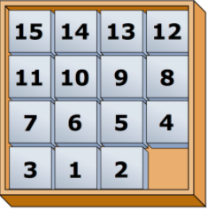

# CS50-fifteen
**_Game of Fifteen_**, per the below.

```$ ./fifteen 3```

WELCOME TO GAME OF FIFTEEN

8  7  6

5  4  3

2  1  _

Tile to move:

## Background
The Game of Fifteen is a puzzle played on a square, two-dimensional board with numbered tiles that slide. The goal of this puzzle is to arrange the board’s tiles from smallest to largest, left to right, top to bottom, with an empty space in board’s bottom-right corner, as in the below.


Sliding any tile that borders the board’s empty space in that space constitutes a "move." Although the configuration above depicts a game already won, notice how the tile numbered 12 or the tile numbered 15 could be slid into the empty space. Tiles may not be moved diagonally, though, or forcibly removed from the board.

Although other configurations are possible, we shall assume that this game begins with the board’s tiles in reverse order, from largest to smallest, left to right, top to bottom, with an empty space in the board’s bottom-right corner. **If, however, and only if the board contains an odd number of tiles (i.e., the height and width of the board are even), the positions of tiles numbered 1 and 2 must be swapped, as in the below.** The puzzle is solvable from this configuration.


